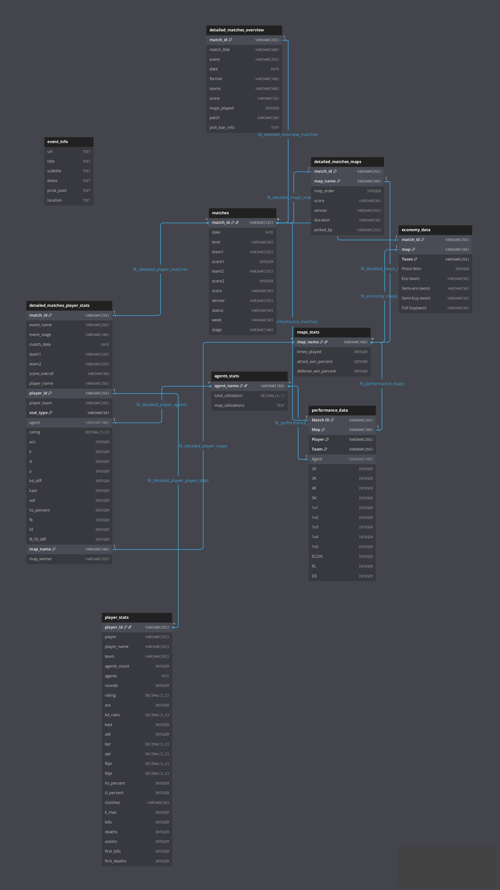

# Valorant Champions 2024 Data Analysis Project
## Company Information

**Company:** Rito Games Analytics Division
**Role:** Data Analyst

## Project Overview

This project represents a comprehensive data analysis initiative conducted for Riot Games, focusing on the Valorant Champions 2024 tournament. As a Data Analyst at Riot Games, I am responsible for analyzing competitive gaming data to provide insights that drive strategic decisions for tournament operations, player development programs, and broadcast enhancement.

The analytics performed in this project encompass performance evaluation, strategic pattern recognition, and predictive modeling to support:

- **Player Performance Assessment**: Identifying top performers and emerging talent through advanced statistical analysis
- **Strategic Intelligence**: Analyzing team compositions, map preferences, and tactical patterns to inform coaching strategies
- **Tournament Optimization**: Providing data-driven insights for tournament format improvements and broadcast enhancement
- **Economic Analysis**: Evaluating team economy management and resource allocation strategies
- **Predictive Analytics**: Developing models to forecast match outcomes and player performance trends

This analysis leverages PostgreSQL database architecture with comprehensive data import scripts and advanced SQL queries to deliver actionable insights for the competitive Valorant ecosystem.

---

A comprehensive data analysis project for Valorant Champions 2024 esports tournament data, featuring PostgreSQL database setup, data import scripts, and analysis capabilities.

## Dataset Overview

Link to download dataset
https://www.kaggle.com/datasets/piyush86kumar/valorant-champions-2024?resource=download

This project contains detailed statistics from Valorant Champions 2024, including:

- **Player Performance**: Individual player statistics, ratings, and performance metrics
- **Match Data**: Match results, scores, and team performance
- **Map Statistics**: Map-specific win rates and utilization data
- **Agent Usage**: Agent pick rates and utilization across different maps
- **Economy Data**: Team economy performance and round-by-round analysis
- **Detailed Match Analysis**: Comprehensive match breakdowns with player-specific stats

## Database Schema

The project uses PostgreSQL with 10 interconnected tables:

- `event_info` - Tournament information
- `matches` - Match results and basic info
- `player_stats` - Individual player statistics
- `maps_stats` - Map-specific performance data
- `agents_stats` - Agent utilization statistics
- `economy_data` - Team economy performance
- `performance_data` - Detailed performance metrics
- `detailed_matches_overview` - Comprehensive match summaries
- `detailed_matches_player_stats` - Player stats per match
- `detailed_matches_maps` - Map-specific match data'

## Entity Relationship Diagram

Below is the ERD for the database schema used in this project:



## Quick Start

### Prerequisites

- **PostgreSQL** (version 12 or higher)
- **Python** (version 3.8 or higher)
- **pip** (Python package manager)
- **Docker** and **Docker Compose** (required for Assignment 4 monitoring stack)

### Installation Steps

1. **Clone or Download the Project**

   ```bash
   # If using git
   git clone <repository-url>
   cd data_v

   # Or simply download and extract the project files
   ```

2. **Install Python Dependencies**

   ```bash
   pip install -r requirements.txt
   ```

3. **Set Up PostgreSQL Database**

   **Option A: Using the provided setup script**

   ```bash
   # Update database credentials in setup_code/setup_database.py
   python setup_code/setup_database.py
   ```

   **Option B: Manual setup**

   ```sql
   -- Connect to PostgreSQL as superuser
   psql -U postgres

   -- Create database
   CREATE DATABASE data_v;

   -- Connect to the new database
   \c data_v

   -- Run the schema creation script
   \i setup_code/creating_sql.sql
   ```

4. **Import CSV Data**
   ```bash
   # Update database credentials in setup_code/import_csv.py
   python setup_code/reset_and_import.py
   python setup_code/import_csv.py
   ```

### Team Headquarters (Geolocation) Import

This project previously included several geo tables and Superset exports. These have been removed and replaced with a simplified `team_headquarters` table storing each team's headquarters coordinates.

1. Prepare the CSV file at `exports/teams_headquarters.csv` with columns:

   - `team`
   - `latitude`
   - `longitude`

   Example:

   ```csv
   team,latitude,longitude
   Team Alpha,37.7749,-122.4194
   Team Beta,51.5074,-0.1278
   ```

2. Run the importer (this will drop legacy geo tables if present):

   ```bash
   python setup_code/import_headquarters.py
   ```

3. Verify the import:

   ```sql
   SELECT * FROM team_headquarters LIMIT 10;
   ```

## Configuration

### Database Configuration

Update the database connection parameters in the following files:

**setup_code/setup_database.py:**

```python
config = {
    'host': 'localhost',
    'user': 'your_username',      # Change this
    'password': 'your_password',   # Change this
    'port': '5432'
}
```

**setup_code/import_csv.py:**

```python
DB_CONFIG = {
    'host': 'localhost',
    'database': 'data_v',
    'user': 'your_username',      # Change this
    'password': 'your_password',   # Change this
    'port': '5432'
}
```

## Project Structure

```
data_v/
├── assignment_4/
│   └── Assignment4/
│       ├── Assignment4.html
│       ├── Assignment4.pdf
│       └── image.png
├── assignment_5/
│   ├── Assignment5/
│   │   ├── Assignment5.html
│   │   └── object/
│   │       └── coffeecup/
│   │           ├── coffee_cup_obj.obj
│   │           └── 29-coffee_cup_obj.zip
│   ├── assignment5_solution_coffeecup.py
│   ├── README.md
│   └── requirements.txt
├── custom_exporter/
│   ├── custom_exporter.py
│   ├── Dockerfile
│   └── requirements.txt
├── custom_exporter_v2/
│   ├── custom_exporter.py
│   ├── Dockerfile
│   └── requirements.txt
├── dashboards/
│   ├── Custom Exporter-*.json
│   ├── Database Exporter-*.json
│   └── Node Exporter-*.json
├── previous_assignments/
│   ├── all_csv/
│   │   ├── agents_stats.csv
│   │   ├── columns_description.csv
│   │   ├── Dataset_info.md
│   │   ├── detailed_matches_maps.csv
│   │   ├── detailed_matches_overview.csv
│   │   ├── detailed_matches_player_stats.csv
│   │   ├── economy_data.csv
│   │   ├── event_info.csv
│   │   ├── maps_stats.csv
│   │   ├── matches.csv
│   │   ├── performance_data.csv
│   │   └── player_stats.csv
│   ├── charts/
│   ├── exports/
│   ├── images/
│   ├── setup_code/
│   ├── cleanup_generated_data.py
│   ├── refresh_data.py
│   ├── generated_matches_log.csv
│   ├── demo_simple.py
│   ├── visualizations_simple.py
│   ├── main.py
│   ├── queries.sql
│   └── requirements.txt
├── docker-compose.yml
├── prometheus.yml
├── metrics.txt
└── README.md
```

## Setup Scripts Explained

### 1. `setup_database.py`

Creates the PostgreSQL database if it doesn't exist.

### 2. `creating_sql.sql`

Contains the complete database schema with:

- Table definitions with proper data types
- Primary key constraints
- Foreign key relationships
- Optimized for PostgreSQL

### 3. `import_csv.py`

Main import script that:

- Handles data cleaning and type conversion
- Manages foreign key constraints
- Filters invalid data
- Handles duplicate entries
- Provides detailed progress reporting

### 4. `reset_and_import.py`

Utility script that:

- Clears existing data
- Temporarily disables foreign key constraints
- Re-enables constraints after clearing
- Automatically runs the import

### 5. `debug_import.py`

Debugging utility to:

- Check data mismatches
- Verify database contents
- Troubleshoot import issues

## Data Features

### Data Cleaning

- **Percentage Values**: Automatically converts "72%" to 72
- **Decimal Precision**: Optimized for actual data ranges
- **Date Handling**: Supports multiple date formats
- **Null Value Management**: Properly handles missing data
- **Case Sensitivity**: Normalizes map names and team names

### Data Validation

- **Foreign Key Integrity**: Ensures referential integrity
- **Duplicate Handling**: Uses ON CONFLICT DO NOTHING for duplicates
- **Invalid Data Filtering**: Removes rows with invalid references
- **Map Name Normalization**: Handles case variations and invalid entries

## Data Statistics

- **Total Tables**: 10
- **Total Rows**: 10,278
- **Database Size**: 9,092 kB

### Table Breakdown:

- `agents_stats`: 162 rows
- `detailed_matches_maps`: 516 rows
- `detailed_matches_overview`: 204 rows
- `detailed_matches_player_stats`: 4,440 rows
- `economy_data`: 781 rows
- `event_info`: 6 rows
- `maps_stats`: 45 rows
- `matches`: 204 rows
- `performance_data`: 3,440 rows
- `player_stats`: 480 rows

## Troubleshooting

### Common Issues

1. **Connection Errors**

   - Verify PostgreSQL is running
   - Check username/password
   - Ensure database exists

2. **Import Failures**

   - Check CSV file paths
   - Verify data format
   - Run debug_import.py for details

3. **Foreign Key Violations**
   - Use reset_and_import.py to clear data
   - Check data cleaning functions
   - Verify map name normalization

### Debug Commands

```bash
# Check database connection
python setup_code/debug_import.py

# Reset and re-import
python setup_code/reset_and_import.py

# Check database statistics
python check_database_stats.py

# Run data analysis queries
python main.py

# Manual database reset
psql -U postgres -d data_v -c "TRUNCATE TABLE detailed_matches_player_stats CASCADE;"
```

## Running the Analysis

After setting up the database and importing data, you can run the analysis script:

```bash
# Install additional dependencies
pip install -r requirements.txt

# Run the main analysis script
python main.py
```

## Generated Data Logging & Cleanup

### Overview

The `refresh_data.py` script can auto-generate match data and log each generated match to `generated_matches_log.csv`. Use `cleanup_generated_data.py` to review and remove generated data safely.

### Generate and Log Data

```bash
python refresh_data.py
```

Each generated match is appended to `generated_matches_log.csv` with timestamp, match_id, teams, score, map, match_date, and count of inserted player records.

### Review the Log

Open `generated_matches_log.csv` in a spreadsheet editor or text editor to inspect what was generated and when.

### Clean Up Generated Data

```bash
python cleanup_generated_data.py
```

Available methods:

- Using the log file: delete all, specific match IDs, or by date range; optionally update the log file after deletion
- By match ID range
- By date

Safety features include preview of deletions, confirmation prompts, and cascading deletes across related tables to maintain referential integrity.

### Log File Management

- The log accumulates over time; delete or archive `generated_matches_log.csv` to start fresh
- A new log file is created automatically on the next run of `refresh_data.py`

## Assignment 4: Prometheus & Grafana Monitoring

This project extends the data analysis capabilities with real-time monitoring and metric collection using **Prometheus** and **Grafana**. Unlike previous assignments that focused on database analysis, Assignment 4 emphasizes **system monitoring** and **collecting metrics from different sources**.

### Overview

The monitoring stack consists of three comprehensive dashboards:

1. **Database Exporter Dashboard** (30 points) - Monitors PostgreSQL performance and internal statistics
2. **Node Exporter Dashboard** (25 points) - Tracks system resources (CPU, memory, disk, network) in real time
3. **Custom Exporter Dashboard** (45 points) - Collects and visualizes custom metrics from the Valorant database using a Python exporter

### Prerequisites for Monitoring

- **Docker** and **Docker Compose** installed
- **PostgreSQL** database running (from previous setup)
- Python 3.8+ with required packages

### Quick Start: Monitoring Stack

1. **Start the Monitoring Services**

   ```bash
   # Start all services (Prometheus, Grafana, and Exporters)
   docker-compose up -d
   ```

2. **Access the Services**

   - **Prometheus**: http://localhost:9090
   - **Grafana**: http://localhost:3000 (default credentials: admin/admin)
   - **Database Exporter**: http://localhost:9187/metrics
   - **Node Exporter**: http://localhost:9100/metrics
   - **Custom Exporter v2 (Weather)**: http://localhost:8001/metrics
   - **Custom Exporter v1 (Valorant DB)**: http://localhost:8000/metrics (disabled)

3. **Import Dashboards to Grafana**

   The project includes three pre-configured dashboard JSON files in the `dashboards/` directory:

   - `Database Exporter-*.json`
   - `Node Exporter-*.json`
   - `Custom Exporter-*.json`

   To import:

   - Log into Grafana (http://localhost:3000)
   - Go to **Dashboards** → **Import**
   - Upload each JSON file from the `dashboards/` directory

### Dashboard Details

#### 1. Database Exporter Dashboard

Monitors PostgreSQL database performance and statistics:

- **Active Connections**: Number of current database connections
- **Database Size**: Total database size in bytes and GB
- **Uptime**: Database server uptime
- **Read/Write Operations**: Rate of database read and write operations
- **Query Processing Speed**: Queries per second (QPS)
- **User Statistics**: Number of users and privileges
- **Table Statistics**: Total number of tables and rows

**Exporter**: `postgres-exporter` running on port `9187`

#### 2. Node Exporter Dashboard

Monitors system resources in real time:

- **CPU Usage**: Per-core CPU utilization
- **Load Average**: System load (1, 5, 15 minutes)
- **Memory**: Total, available, and used memory in GB
- **RAM Usage**: Memory usage percentage
- **Disk Space**: Free disk space in GB
- **Disk I/O**: Read and write operations (bytes/sec)
- **Network Traffic**: Incoming/outgoing traffic (Mbit/sec)
- **CPU Temperature**: Processor temperature monitoring
- **Battery Status**: Battery level and health (for laptops)

**Exporter**: `node-exporter` running on port `9100`

#### 3. Custom Exporter Dashboard

Collects custom metrics from external APIs using a Python exporter. The project includes two custom exporter implementations:

**Currently Active: Custom Exporter v2 (OpenWeatherMap API)**

- **Weather Metrics**: Temperature, humidity, pressure, wind speed/direction
- **Atmospheric Conditions**: Cloudiness, visibility, rain/snow volume
- **Additional Data**: Feels-like temperature, UV index, sunrise/sunset times

**Exporter**: Custom Python exporter running on port `8001`

**Update Frequency**: Metrics are collected every 20 seconds

**Alternative: Custom Exporter v1 (Valorant Database - Currently Disabled)**

- **Player Statistics**: Total player count, average rating, top player rating
- **Combat Metrics**: Total kills, deaths, assists across all players
- **Match Statistics**: Total matches, completed matches
- **Map Performance**: Average attack/defense win percentages
- **Agent Metrics**: Total agents tracked, average utilization
- **Map Activity**: Total map rounds played

**Exporter**: Custom Python exporter running on port `8000` (disabled in docker-compose.yml)

### Custom Exporter v2 (OpenWeatherMap API)

The custom exporter v2 (`custom_exporter_v2/custom_exporter.py`) fetches weather data from the OpenWeatherMap API and exposes metrics in Prometheus format.

**Key Features:**

- Fetches real-time weather data from OpenWeatherMap API
- Collects 13 custom weather metrics
- Updates metrics every 20 seconds
- Exposes metrics via HTTP endpoint on port 8001
- Uses `prometheus_client` library for metric publishing
- Includes retry logic and error handling for API calls

**Setup Requirements:**

1. **Get an OpenWeatherMap API Key:**

   - Sign up at https://openweathermap.org/api
   - Free tier includes 1,000 API calls/day (sufficient for 20-second intervals)
   - Copy your API key

2. **Set the API Key:**
   - Edit `custom_exporter_v2/custom_exporter.py` and set `API_KEY = "your_api_key_here"`
   - Or use environment variable: `OPENWEATHER_API_KEY=your_api_key_here`
   - Configure city: `CITY = "London"` (or use `WEATHER_CITY` environment variable)

**Metrics Collected:**

- `weather_temperature_celsius` - Current temperature in Celsius (labeled by city)
- `weather_humidity_percent` - Humidity percentage
- `weather_pressure_hpa` - Atmospheric pressure in hPa
- `weather_wind_speed_mps` - Wind speed in m/s
- `weather_wind_direction_deg` - Wind direction in degrees
- `weather_cloudiness_percent` - Cloud coverage percentage
- `weather_visibility_km` - Visibility in kilometers
- `weather_rain_volume_mm` - Rain volume in last hour (mm)
- `weather_snow_volume_mm` - Snow volume in last hour (mm)
- `weather_feels_like_celsius` - Feels-like temperature
- `weather_uv_index` - UV index (requires One Call API for full functionality)
- `weather_sunrise_timestamp` - Sunrise timestamp (Unix)
- `weather_sunset_timestamp` - Sunset timestamp (Unix)

All metrics include a `city` label for filtering.

### Custom Exporter v1 (Valorant Database - Optional)

The custom exporter v1 (`custom_exporter/custom_exporter.py`) collects Valorant-specific metrics from the PostgreSQL database. This exporter is currently disabled in `docker-compose.yml` but can be enabled if needed.

**Key Features:**

- Connects to the `data_v` PostgreSQL database
- Collects 13 custom metrics related to Valorant tournament data
- Updates metrics every 20 seconds
- Exposes metrics via HTTP endpoint on port 8000

**Metrics Collected (when enabled):**

- `valorant_player_count_total` - Total number of players
- `valorant_average_player_rating` - Average player rating
- `valorant_top_player_rating` - Highest player rating
- `valorant_total_kills` - Total kills across all players
- `valorant_total_deaths` - Total deaths across all players
- `valorant_total_assists` - Total assists across all players
- `valorant_matches_total` - Total number of matches
- `valorant_matches_completed_total` - Number of completed matches
- `valorant_average_attack_win_percent` - Average attack win percentage
- `valorant_average_defense_win_percent` - Average defense win percentage
- `valorant_agents_total` - Total number of agents
- `valorant_average_agent_utilization` - Average agent utilization
- `valorant_total_map_rounds_played` - Total map rounds played

### Configuration Files

#### `docker-compose.yml`

Defines all monitoring services:

- Prometheus server
- Grafana dashboard
- PostgreSQL exporter
- Node exporter
- Custom Python exporter

#### `prometheus.yml`

Prometheus configuration file that:

- Sets scrape interval to 15 seconds
- Configures targets for all exporters
- Defines job names for each exporter

#### `custom_exporter_v2/custom_exporter.py`

Python script that:

- Fetches weather data from OpenWeatherMap API
- Collects 13 weather-related metrics
- Exposes metrics via Prometheus client library
- Runs as a Docker container
- Includes retry logic and error handling

**Note:** To use this exporter, you need to:

1. Get an OpenWeatherMap API key from https://openweathermap.org/api
2. Set `API_KEY` in `custom_exporter_v2/custom_exporter.py`
3. Optionally configure the city to monitor (defaults to "London")

### Dashboard Requirements

Each dashboard includes:

- **≥10 PromQL Queries**: At least 10 Prometheus Query Language queries
- **Function Usage**: 60% of queries use functions (`avg`, `rate`, `sum`, `count`, `time()`) or time filters (`[5m]`, `by()`, `grouping`)
- **≥10 Visualizations**: Multiple visualization types (time series, gauge, heatmap, bar charts, etc.)
- **≥4 Visualization Types**: At least 4 different chart types per dashboard
- **Global Filter**: Dashboard variable configured for filtering across all panels
- **Alert Rules**: At least one alert rule configured in Grafana
- **Real-time Updates**: All metrics update in real time

### Verifying the Setup

1. **Check Container Status**

   ```bash
   docker-compose ps
   ```

   All containers should show "Up" status.

2. **Verify Prometheus Targets**

   - Navigate to http://localhost:9090/targets
   - All targets should show "UP" status

3. **Test PromQL Queries**

   - Go to http://localhost:9090/graph
   - Test queries like:
     - `up` - Check if exporters are running
     - `valorant_player_count_total` - Custom metric
     - `pg_stat_database_numbackends` - Database connections

4. **View Dashboards**

   - Access Grafana at http://localhost:3000
   - Navigate to imported dashboards
   - Verify all panels display data correctly

### Troubleshooting Monitoring

1. **Containers Not Starting**

   - Check Docker is running: `docker ps`
   - View logs: `docker-compose logs [service-name]`
   - Verify ports are not in use

2. **Exporters Not Accessible**

   - Verify exporter containers are running
   - Check network connectivity: `docker network ls`
   - Test endpoints: `curl http://localhost:9187/metrics`

3. **Prometheus Not Scraping**

   - Check `prometheus.yml` configuration
   - Verify target endpoints in Prometheus UI
   - Check network connectivity between containers

4. **Grafana Not Showing Data**

   - Verify Prometheus data source is configured
   - Check time range in dashboard
   - Verify PromQL queries return data in Prometheus UI

### Stopping the Monitoring Stack

```bash
# Stop all services
docker-compose down

# Stop and remove volumes (clears data)
docker-compose down -v
```

## Assignment 5: 3D Object Processing with Open3D

This assignment demonstrates 3D object processing using the Open3D library in Python. It covers advanced 3D data manipulation techniques including mesh processing, point cloud operations, surface reconstruction, and voxelization.

### Overview

Assignment 5 focuses on working with 3D objects using Python's Open3D library. The assignment includes 7 comprehensive tasks that demonstrate understanding of 3D geometry, mesh manipulation, and visualization.

### 3D Model

- **Model**: Coffee Cup (Low Poly)
- **Format**: OBJ
- **Location**: `assignment_5/Assignment5/object/coffeecup/coffee_cup_obj.obj`

### Tasks Implemented

1. **Loading and Visualization** - Load 3D OBJ files with gradient coloring
2. **Point Cloud Conversion** - Convert mesh to point cloud with uniform sampling
3. **Surface Reconstruction** - Rebuild mesh from point cloud using Poisson reconstruction
4. **Voxelization** - Convert point cloud to voxel grid representation
5. **Plane Addition** - Add geometric plane intersecting the object
6. **Surface Clipping** - Clip mesh using plane to show cross-sections
7. **Color and Extremes** - Apply gradient coloring and detect extreme points

### Quick Start

```bash
cd assignment_5
pip install -r requirements.txt
python assignment5_solution_coffeecup.py
```

### Detailed Documentation

For complete documentation about Assignment 5, including:
- Detailed task descriptions
- Installation instructions
- Visualization controls
- Technical implementation notes

Please refer to: `assignment_5/README.md`

### Features

- Automatic handling of quad-based OBJ files
- Beautiful gradient coloring for visualization
- KD-tree based color transfer for reconstructed meshes
- Interactive 3D visualization with mouse controls
- Comprehensive console output for each task
- Support for multiple 3D model formats

## Recent Updates

- **Assignment 5: 3D Object Processing** - Complete implementation of 7 tasks with Open3D library for 3D mesh and point cloud processing

- Interactive Time Slider (Plotly)

  - Play/Pause animation with cumulative frames so lines connect over time
  - One point per player per day (best-rated match on that day)
  - Adjustable player selection via `TIMELINE_PLAYER_LIMIT` in `visualizations_simple.py`
  - Robust date parsing and guaranteed HTML output (placeholder if no data)
  - Output: `charts/interactive_player_performance_timeline.html`

- Demo: Adding a Demo Player
  - `demo_simple.py` now inserts a "Demo Player", regenerates the ACS vs Rating chart, highlights the new point with a red star, then cleans up
  - Output files: `charts/demo_scatter_plot_YYYYMMDD_HHMMSS.png` (BEFORE/AFTER)
  - Alternative read-only demo: `demo_chart_regeneration.py` (no DB writes)
