# Valorant Champions 2024 Data Analysis Project
## Company Information

**Company:** Rito Games Analytics Division
**Role:** Data Analyst

## Project Overview

This project represents a comprehensive data analysis initiative conducted for Riot Games, focusing on the Valorant Champions 2024 tournament. As a Data Analyst at Riot Games, I am responsible for analyzing competitive gaming data to provide insights that drive strategic decisions for tournament operations, player development programs, and broadcast enhancement.

The analytics performed in this project encompass performance evaluation, strategic pattern recognition, and predictive modeling to support:

- **Player Performance Assessment**: Identifying top performers and emerging talent through advanced statistical analysis
- **Strategic Intelligence**: Analyzing team compositions, map preferences, and tactical patterns to inform coaching strategies
- **Tournament Optimization**: Providing data-driven insights for tournament format improvements and broadcast enhancement
- **Economic Analysis**: Evaluating team economy management and resource allocation strategies
- **Predictive Analytics**: Developing models to forecast match outcomes and player performance trends

This analysis leverages PostgreSQL database architecture with comprehensive data import scripts and advanced SQL queries to deliver actionable insights for the competitive Valorant ecosystem.

---

A comprehensive data analysis project for Valorant Champions 2024 esports tournament data, featuring PostgreSQL database setup, data import scripts, and analysis capabilities.

## Dataset Overview

Link to download dataset
https://www.kaggle.com/datasets/piyush86kumar/valorant-champions-2024?resource=download

This project contains detailed statistics from Valorant Champions 2024, including:

- **Player Performance**: Individual player statistics, ratings, and performance metrics
- **Match Data**: Match results, scores, and team performance
- **Map Statistics**: Map-specific win rates and utilization data
- **Agent Usage**: Agent pick rates and utilization across different maps
- **Economy Data**: Team economy performance and round-by-round analysis
- **Detailed Match Analysis**: Comprehensive match breakdowns with player-specific stats

## Database Schema

The project uses PostgreSQL with 10 interconnected tables:

- `event_info` - Tournament information
- `matches` - Match results and basic info
- `player_stats` - Individual player statistics
- `maps_stats` - Map-specific performance data
- `agents_stats` - Agent utilization statistics
- `economy_data` - Team economy performance
- `performance_data` - Detailed performance metrics
- `detailed_matches_overview` - Comprehensive match summaries
- `detailed_matches_player_stats` - Player stats per match
- `detailed_matches_maps` - Map-specific match data

## Quick Start

### Prerequisites

- **PostgreSQL** (version 12 or higher)
- **Python** (version 3.8 or higher)
- **pip** (Python package manager)

### Installation Steps

1. **Clone or Download the Project**

   ```bash
   # If using git
   git clone <repository-url>
   cd data_v

   # Or simply download and extract the project files
   ```

2. **Install Python Dependencies**

   ```bash
   pip install -r requirements.txt
   ```

3. **Set Up PostgreSQL Database**

   **Option A: Using the provided setup script**

   ```bash
   # Update database credentials in setup_code/setup_database.py
   python setup_code/setup_database.py
   ```

   **Option B: Manual setup**

   ```sql
   -- Connect to PostgreSQL as superuser
   psql -U postgres

   -- Create database
   CREATE DATABASE data_v;

   -- Connect to the new database
   \c data_v

   -- Run the schema creation script
   \i setup_code/creating_sql.sql
   ```

4. **Import CSV Data**
   ```bash
   # Update database credentials in setup_code/import_csv.py
   python setup_code/reset_and_import.py
   python setup_code/import_csv.py
   ```

## Configuration

### Database Configuration

Update the database connection parameters in the following files:

**setup_code/setup_database.py:**

```python
config = {
    'host': 'localhost',
    'user': 'your_username',      # Change this
    'password': 'your_password',   # Change this
    'port': '5432'
}
```

**setup_code/import_csv.py:**

```python
DB_CONFIG = {
    'host': 'localhost',
    'database': 'data_v',
    'user': 'your_username',      # Change this
    'password': 'your_password',   # Change this
    'port': '5432'
}
```

## Project Structure

```
data_v/
├── all_csv/                          # CSV data files
│   ├── event_info.csv
│   ├── matches.csv
│   ├── player_stats.csv
│   ├── maps_stats.csv
│   ├── agents_stats.csv
│   ├── economy_data.csv
│   ├── performance_data.csv
│   ├── detailed_matches_overview.csv
│   ├── detailed_matches_player_stats.csv
│   ├── detailed_matches_maps.csv
│   └── columns_description.csv
├── setup_code/                       # Database setup scripts
│   ├── creating_sql.sql             # PostgreSQL schema
│   ├── setup_database.py            # Database creation
│   ├── import_csv.py                # CSV import script
│   ├── reset_and_import.py          # Database reset utility
│   └── debug_import.py              # Debugging utility
├── requirements.txt                  # Python dependencies
├── README.md                        # This file
└── Dataset_info.md                  # Detailed dataset information
```

## Setup Scripts Explained

### 1. `setup_database.py`

Creates the PostgreSQL database if it doesn't exist.

### 2. `creating_sql.sql`

Contains the complete database schema with:

- Table definitions with proper data types
- Primary key constraints
- Foreign key relationships
- Optimized for PostgreSQL

### 3. `import_csv.py`

Main import script that:

- Handles data cleaning and type conversion
- Manages foreign key constraints
- Filters invalid data
- Handles duplicate entries
- Provides detailed progress reporting

### 4. `reset_and_import.py`

Utility script that:

- Clears existing data
- Temporarily disables foreign key constraints
- Re-enables constraints after clearing
- Automatically runs the import

### 5. `debug_import.py`

Debugging utility to:

- Check data mismatches
- Verify database contents
- Troubleshoot import issues

## Data Features

### Data Cleaning

- **Percentage Values**: Automatically converts "72%" to 72
- **Decimal Precision**: Optimized for actual data ranges
- **Date Handling**: Supports multiple date formats
- **Null Value Management**: Properly handles missing data
- **Case Sensitivity**: Normalizes map names and team names

### Data Validation

- **Foreign Key Integrity**: Ensures referential integrity
- **Duplicate Handling**: Uses ON CONFLICT DO NOTHING for duplicates
- **Invalid Data Filtering**: Removes rows with invalid references
- **Map Name Normalization**: Handles case variations and invalid entries

## Data Statistics

- **Total Tables**: 10
- **Total Rows**: 10,278
- **Database Size**: 9,092 kB

### Table Breakdown:

- `agents_stats`: 162 rows
- `detailed_matches_maps`: 516 rows
- `detailed_matches_overview`: 204 rows
- `detailed_matches_player_stats`: 4,440 rows
- `economy_data`: 781 rows
- `event_info`: 6 rows
- `maps_stats`: 45 rows
- `matches`: 204 rows
- `performance_data`: 3,440 rows
- `player_stats`: 480 rows

## Troubleshooting

### Common Issues

1. **Connection Errors**

   - Verify PostgreSQL is running
   - Check username/password
   - Ensure database exists

2. **Import Failures**

   - Check CSV file paths
   - Verify data format
   - Run debug_import.py for details

3. **Foreign Key Violations**
   - Use reset_and_import.py to clear data
   - Check data cleaning functions
   - Verify map name normalization

### Debug Commands

```bash
# Check database connection
python setup_code/debug_import.py

# Reset and re-import
python setup_code/reset_and_import.py

# Check database statistics
python check_database_stats.py

# Run data analysis queries
python main.py

# Manual database reset
psql -U postgres -d data_v -c "TRUNCATE TABLE detailed_matches_player_stats CASCADE;"
```

## Running the Analysis

After setting up the database and importing data, you can run the analysis script:

```bash
# Install additional dependencies
pip install -r requirements.txt

# Run the main analysis script
python main.py
```

This will execute various SQL queries and display formatted results including:

- Basic data exploration
- Filtering, aggregation, and sorting examples
- Different types of JOIN operations (INNER, LEFT, RIGHT)
- 10 analytical topics covering player performance, map analysis, agent utilization, and more

## Query Execution Results

The following images show the results of executing the queries from `queries.sql`:

### Basic Data Exploration Queries

**1a. Data Structure Overview - First 10 rows from each table:**
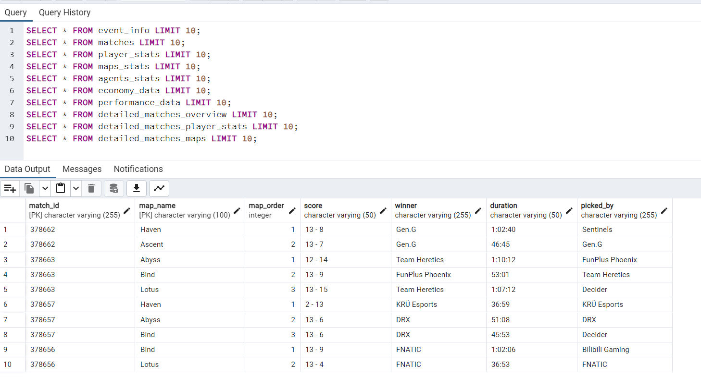

**1b. Top 10 Players by Rating (100+ rounds):**
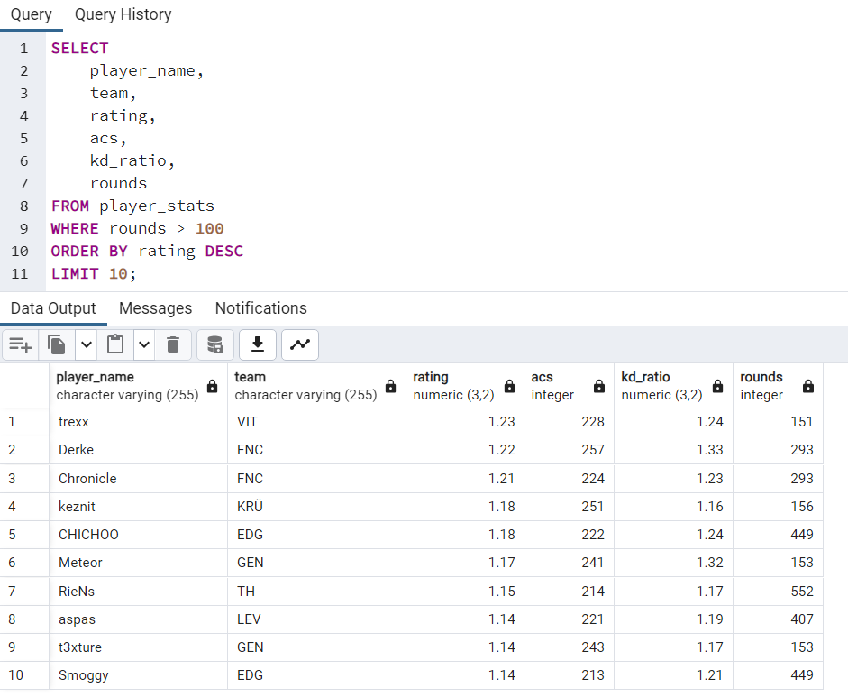

**1c. Team Statistics with Aggregation:**
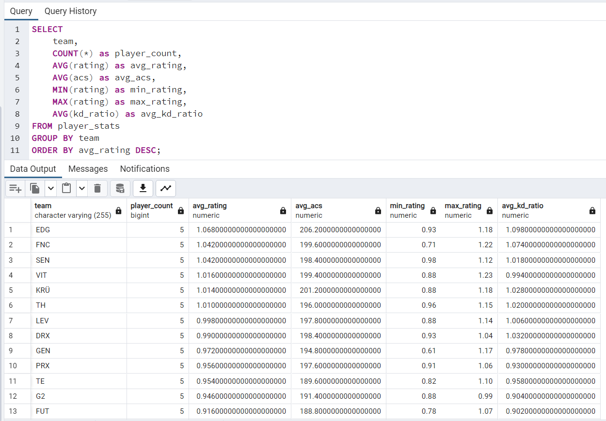

**1d. Player Performance with Match Data (INNER JOIN):**
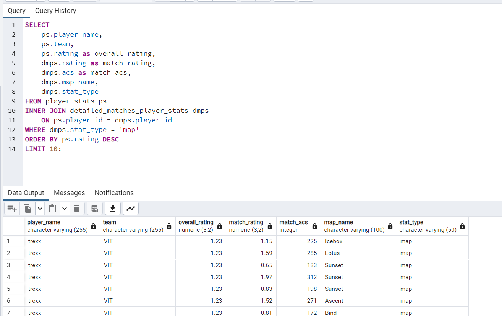

### Analytical Topics Results

**Topic 1: Top Performing Players by Overall Rating**
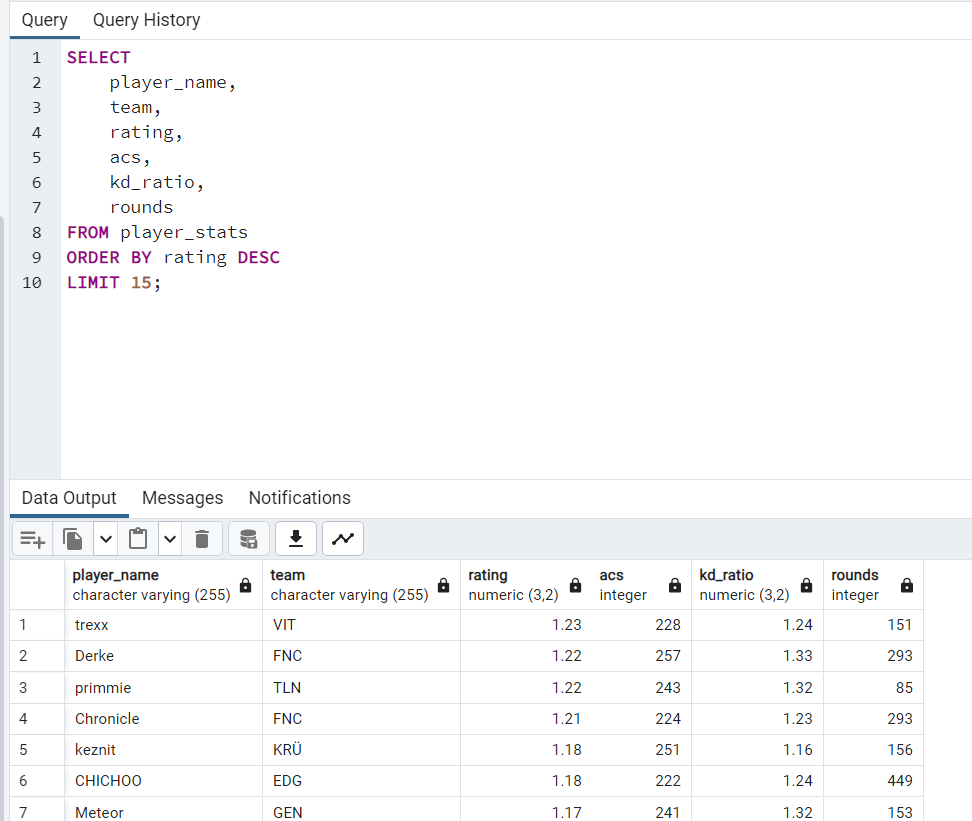

**Topic 2: Map Win Rate Analysis**
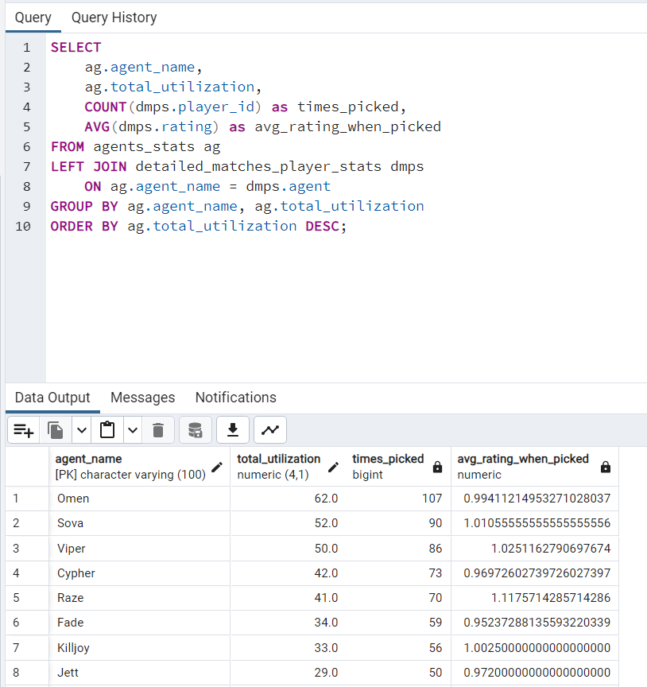

**Topic 3: Agent Utilization and Performance**
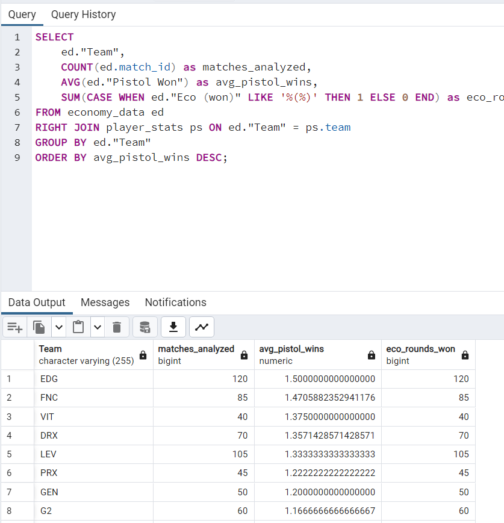

**Topic 4: Team Economy Performance**
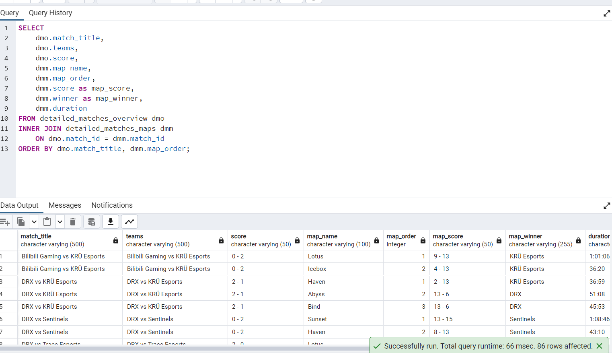

**Topic 5: Match Duration and Map Performance**
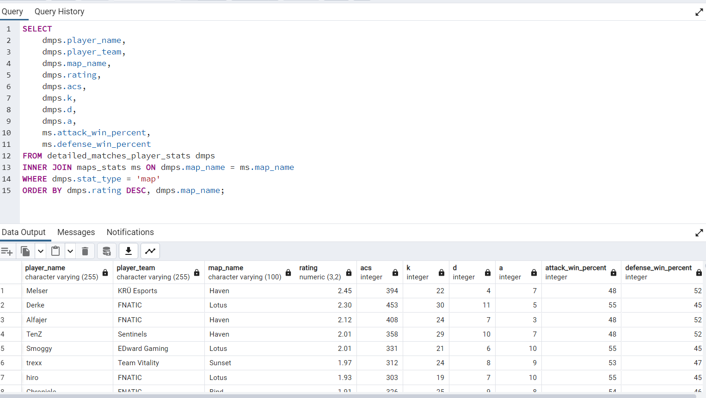

**Topic 6: Player Performance by Map**
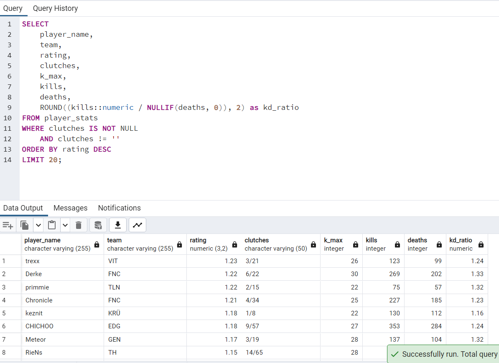

**Topic 7: Clutch Performance Analysis**
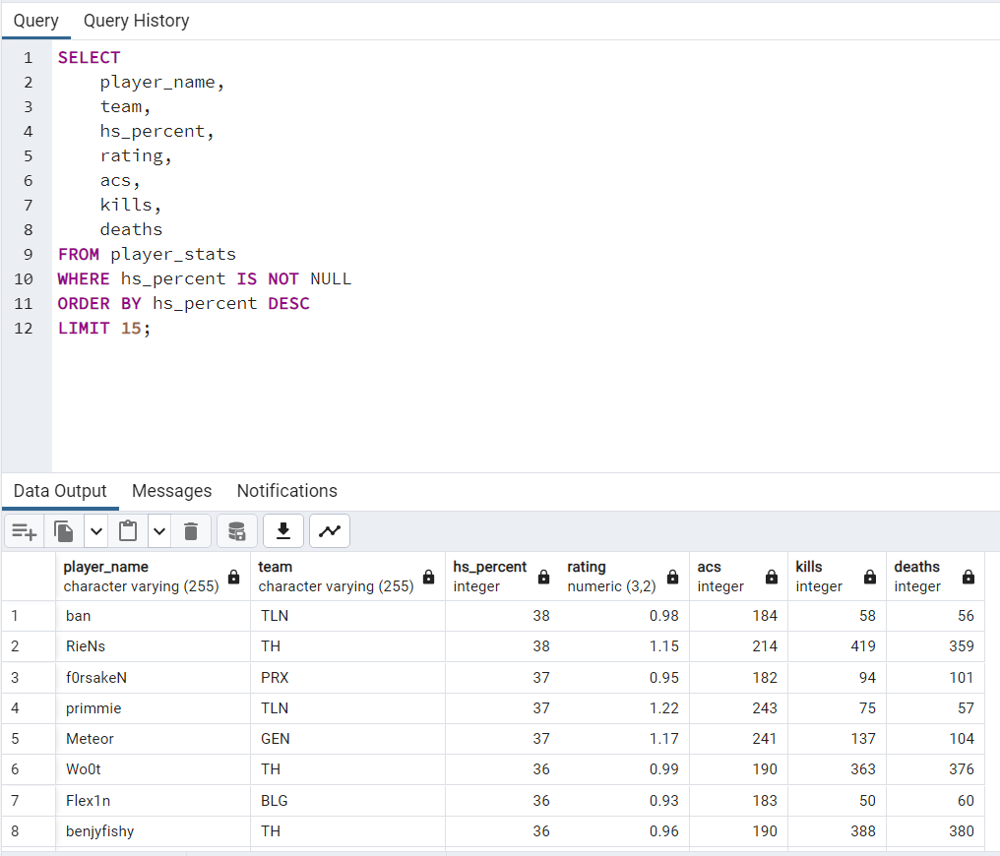

**Topic 8: Headshot Accuracy Leaders**
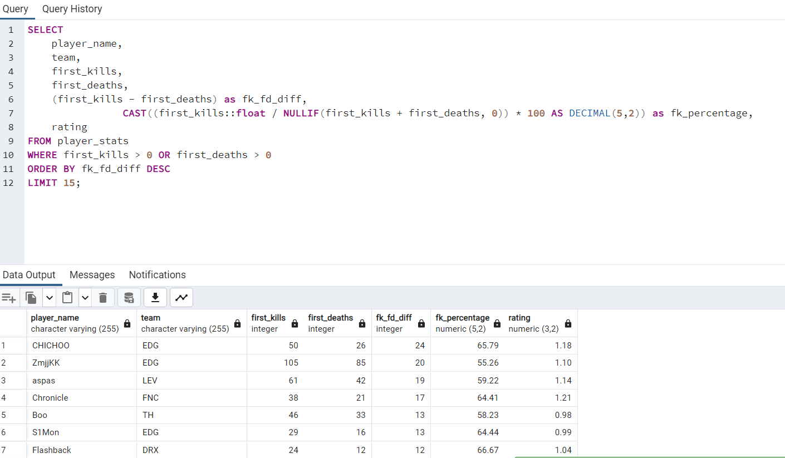

**Topic 9: First Kill/First Death Impact**
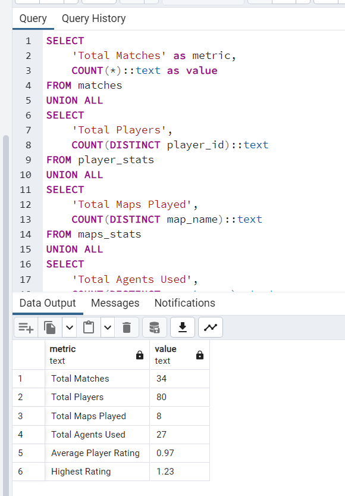

## Database Setup Visualizations

**Database Tables Structure:**
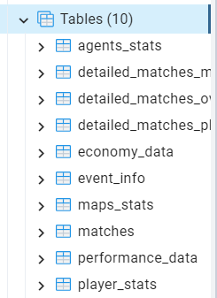

**Create Tables Query Execution:**
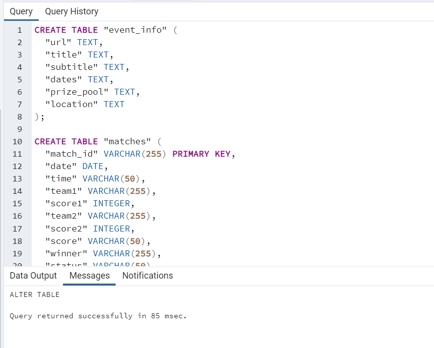
